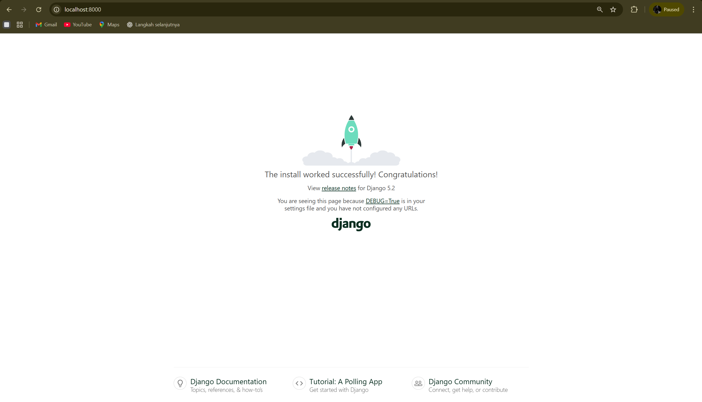
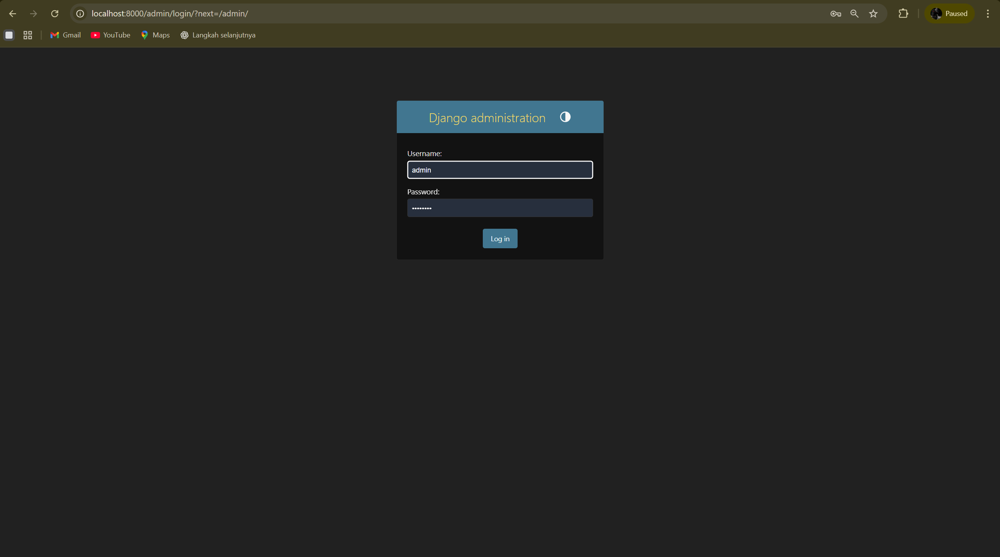

🎓 Simple LMS - Docker & Django

📦 Deskripsi

Project **Simple LMS (Learning Management System)** ini dibuat menggunakan **Django** dan **PostgreSQL** dengan pendekatan **containerization menggunakan Docker**.

Project ini bertujuan untuk memahami:

* Konsep Docker & container
* Multi-container dengan Docker Compose
* Integrasi Django dengan PostgreSQL
* Setup backend modern yang portable

🛠️ Teknologi yang Digunakan

* Python 3.11
* Django
* PostgreSQL
* Docker & Docker Compose


 📁 Struktur Project


simple-lms/
├── docker-compose.yml
├── Dockerfile
├── .env.example
├── requirements.txt
├── manage.py
├── config/
│   ├── settings.py
│   ├── urls.py
│   └── wsgi.py
└── README.md
 ⚙️ Environment Variables

Buat file `.env` berdasarkan `.env.example`

Contoh:


DB_NAME=postgres
DB_USER=postgres
DB_PASSWORD=postgres
DB_HOST=postgres_db
DB_PORT=5432
 🐳 Docker Services

Project ini menggunakan beberapa service utama:

1. Web (Django)

* Menjalankan aplikasi Django
* Port: `8000`

2. Database (PostgreSQL)

* Menyimpan data aplikasi
* Menggunakan volume agar data persistent

3. Redis

* Menyediakan cache untuk daftar course dan detail course
* Dipakai juga sebagai backend Celery result

4. RabbitMQ

* Message broker untuk Celery task queue

5. MongoDB

* Menyimpan log aktivitas dan analytics


 🚀 Cara Menjalankan Project
 1. Clone Repository


git clone https://github.com/USERNAME/simple-lms.git
cd simple-lms
 2. Buat File Environment


cp .env.example .env


(Atau buat manual jika di Windows)

 3. Jalankan Docker

docker-compose up --build

 4. Jalankan Migration

Buka terminal baru:


docker-compose run web python manage.py migrate


 5. Buat Superuser

docker-compose run web python manage.py createsuperuser

 6. Jalankan Celery Worker & Scheduler

docker-compose up -d celery-worker celery-beat flower

### Celery Task Queue

Service Celery digunakan untuk memproses task asynchronous di background. Di project ini:

- `celery-worker` menjalankan worker yang mengambil task dari RabbitMQ
- `celery-beat` menjalankan scheduler untuk task berkala
- `flower` menyediakan dashboard monitoring task

#### Jalankan Celery secara manual

```bash
docker compose run web celery -A config worker --loglevel=info
```

```bash
docker compose run web celery -A config beat --loglevel=info
```

#### Jalankan dengan Docker Compose

```bash
docker compose up -d celery-worker celery-beat flower
```

#### Monitor Task dengan Flower

Buka:

http://localhost:5555

Di Flower kamu bisa melihat:

- status worker
- antrean task
- hasil task
- task yang gagal

### API Task Examples

- Submit request sertifikat: `POST /api/v1/courses/{id}/request-certificate/`
- Export laporan course: `POST /api/v1/courses/{id}/export-report/`
- Jadwalkan ulang statistik: `POST /api/v1/analytics/schedule-statistics/`
- Cek status task: `GET /api/v1/tasks/{task_id}/`

### Troubleshooting

- Pastikan `rabbitmq` dan `redis` sudah aktif sebelum memulai worker
- Jalankan `docker compose logs celery-worker` untuk melihat error worker
- Jika task tidak selesai, cek `flower` atau log `celery-beat`

🌐 Akses Aplikasi

* Homepage Django:
  http://localhost:8000

* Admin Panel:
  http://localhost:8000/admin


📸 Screenshot

 Halaman Django



### Admin Panel (Opsional)



✅ Fitur yang Berhasil Dibuat

* Docker multi-container (web + database)
* Django berjalan di container
* PostgreSQL terintegrasi
* Migration database berhasil
* Admin panel aktif
* Redis caching untuk course list dan detail
* RabbitMQ & Celery untuk task queue
* MongoDB untuk activity logs dan analytics
* Flower untuk monitoring Celery
* Dokumentasi arsitektur dan Redis CLI tersedia di `docs/`
* Panduan integrasi asynchronous task tersedia di `docs/module14_async_architecture.md`

🎯 Hasil Pembelajaran

Dari project ini, saya memahami:

* Cara membuat Dockerfile dan docker-compose
* Cara menjalankan aplikasi Django di Docker
* Konfigurasi PostgreSQL dalam container
* Penggunaan environment variables
* Best practice struktur project backend

 👤 Author

Aldi Febriayanto
NIM: A11.2023.15056

 📌 Catatan

* Pastikan Docker Desktop sudah berjalan sebelum menjalankan project
* Gunakan `.env` untuk konfigurasi environment
* Data PostgreSQL disimpan menggunakan Docker Volume

🏁 Status

 Project selesai dan siap dijalankan
 Sesuai dengan kriteria penilaian tugas
