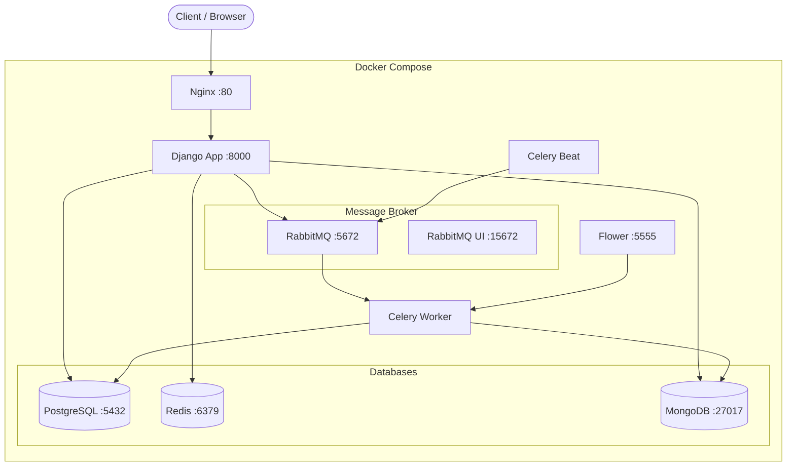

# Simple LMS - Advanced Features & Integration

## Architecture Diagram



## Caching Strategy

### Overview
Redis digunakan sebagai cache layer antara Django dan PostgreSQL untuk mengurangi database queries dan mempercepat response time.

### Cache Keys
| Key Pattern | TTL | Keterangan |
|---|---|---|
| `course_list:{page}:{per_page}:{search}:{ordering}` | 300s | Cache hasil list courses |
| `course_detail:{id}` | 300s | Cache detail satu course |

### Flow: Cache-Aside Pattern
Request GET /courses
│
▼
Cek Redis cache
│
├── HIT  → Return cached data (< 1ms)
│
└── MISS → Query PostgreSQL
│
▼
Simpan ke Redis (TTL 300s)
│
▼
Return data ke client

### Cache Invalidation
Cache dihapus otomatis saat:
- Course dibuat (`POST /courses`) → hapus semua `course_list:*`
- Course diupdate (`PATCH /courses/{id}`) → hapus `course_detail:{id}` + `course_list:*`
- Course dihapus (`DELETE /courses/{id}`) → hapus `course_detail:{id}` + `course_list:*`
- Course image diupdate → hapus `course_detail:{id}` + `course_list:*`

### Redis CLI Commands
```bash
# Masuk Redis CLI
docker exec -it redis_cache redis-cli

# Lihat semua cache keys
KEYS *

# Lihat cache course list
KEYS course_list:*

# Lihat cache course detail
KEYS course_detail:*

# Baca nilai cache
GET course_detail:1

# Cek TTL sebuah key (dalam detik)
TTL course_detail:1

# Hapus cache tertentu
DEL course_detail:1

# Hapus semua cache
FLUSHALL

# Statistik Redis
INFO stats
INFO memory

# Monitor real-time commands
MONITOR
```

## Celery Task Flow

### Task 1: send_enrollment_email
POST /enrollments?course_id=X
│
▼
CourseMember dibuat di PostgreSQL
│
▼
send_enrollment_email.delay(user_id, course_id)
│
▼ (async via RabbitMQ)
Celery Worker menerima task
│
▼
Kirim email ke user (simulasi print)
│
▼
Log ke MongoDB: activity_logs { action: "enrollment_email_sent" }
│
▼
Return { status: "success" }

### Task 2: generate_certificate
Dipanggil saat course selesai
│
▼ (async via RabbitMQ)
Celery Worker generate certificate data
│
├── certificate_id: CERT-{user_id}-{course_id}-{date}
├── user: nama lengkap
├── course: nama course
└── issued_at: timestamp
│
▼
Log ke MongoDB: activity_logs { action: "certificate_generated" }

### Task 3: update_course_statistics (Scheduled)
Celery Beat (scheduler)
│
▼ Setiap interval terjadwal
Ambil semua Course dari PostgreSQL
│
▼
Hitung enrollment_count per course
│
▼
Hapus data lama di MongoDB: course_statistics
│
▼
Insert data baru ke MongoDB: course_statistics

### Task 4: export_course_report
POST /reports/export
│
▼
export_course_report.delay(course_id)
│
▼ Return langsung ke client:
{ task_id: "...", status: "processing" }
│
▼ (async via RabbitMQ)
Celery Worker generate CSV
│
▼
Log ke MongoDB: activity_logs { action: "report_generated" }
│
▼
Return CSV content + row count

## MongoDB Collections

### activity_logs
Menyimpan semua aktivitas user untuk audit trail dan analytics.
```json
{
  "user_id": 1,
  "action": "enrollment",
  "details": {
    "course_id": 5,
    "course_name": "Belajar Django"
  },
  "timestamp": "2026-05-24T08:00:00Z"
}
```
Actions yang di-log: `login`, `enrollment`, `enrollment_email_sent`, `certificate_generated`, `report_generated`, `course_view`

### course_statistics
Snapshot statistik enrollment per course, diupdate oleh scheduled task.
```json
{
  "course_id": 1,
  "course_name": "Belajar Django",
  "enrollment_count": 42,
  "updated_at": "2026-05-24T08:00:00Z"
}
```

## Monitoring

### Flower (Celery Monitoring)
URL: http://localhost:5555
- Monitor active/completed/failed tasks
- Lihat worker status dan task history
- Retry failed tasks secara manual

### RabbitMQ Management UI
URL: http://localhost:15672
- Username: lms_user / Password: lms_pass
- Monitor queues, messages, connections
- Lihat message rates dan consumer stats

## Docker Services Summary

| Service | Image | Port | Fungsi |
|---|---|---|---|
| web | python:3.11-slim | 8000 | Django REST API |
| db | postgres:15 | 5432 | Primary database |
| redis | redis:7-alpine | 6379 | Cache + Celery result backend |
| mongodb | mongo:7 | 27017 | Activity logs + analytics |
| rabbitmq | rabbitmq:3-management | 5672, 15672 | Message broker untuk Celery |
| celery-worker | python:3.11-slim | - | Async task processor |
| celery-beat | python:3.11-slim | - | Scheduled task scheduler |
| flower | python:3.11-slim | 5555 | Celery monitoring dashboard |
