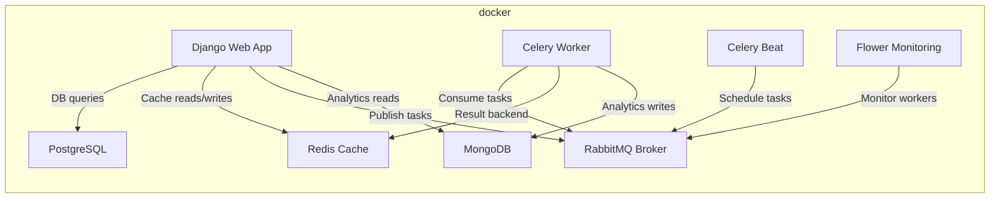

# Architecture and Integration Overview

## System Components

## Integration Summary

- Redis digunakan untuk caching `courses` list dan detail.
- MongoDB digunakan untuk menyimpan `activity_logs`, `learning_analytics`, `reports`, dan `certificates`.
- RabbitMQ bertindak sebagai broker pesan untuk Celery.
- Celery Worker memproses task asinkron dan Celery Beat menjadwalkan update statistik.
- Flower menyediakan monitoring Celery pada port `5555`.

## Task Flow

1. Student enrolls ke course.
2. Endpoint `POST /enrollments` membuat `CourseMember` dan menambah popularity cache.
3. Tugas `send_enrollment_email` dijalankan secara asinkron.
4. Setelah student menyelesaikan course, `POST /courses/{id}/complete` memicu `generate_certificate`.
5. `update_course_statistics` dijadwalkan oleh Celery Beat setiap menit.
6. `export_course_report` membuat CSV dan menyimpannya ke MongoDB metadata.
